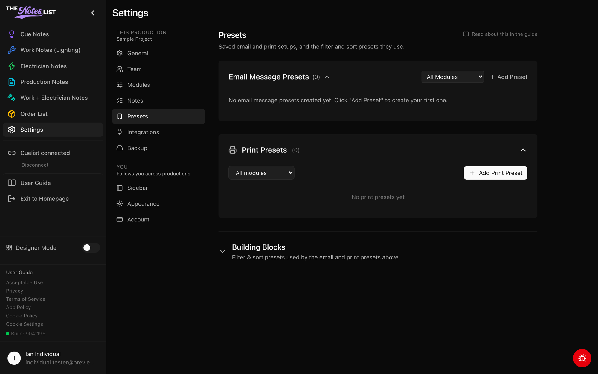

# Presets

**Settings → Presets** holds saved setups for sending and printing notes, so your end-of-day routine is one click instead of ten. Presets belong to the production and are shared with everyone on it.



### Email Message Presets

Creating your end-of-day email preset can be one of the most valuable tools The Notes List offers. Use **Add Preset** to fully customize your email export. Options include:

* Preset name
* Module assigned
* Email recipients
* Subject line, with live badges such as the production name or date
* Message body
* Filter & sort preset

Use the **All Modules** filter to show only the presets for one module.

<figure><figcaption></figcaption></figure>



### Print Presets

**Add Print Preset** saves a PDF setup for a module: which notes to include, how they're sorted, and the page layout. Print presets appear when you print from a notes page.



### Building Blocks

Open **Building Blocks** to manage filter & sort presets: which statuses, types and priorities to include, and in what order. Email and print presets use these, so you can set up a filter once and reuse it everywhere.


