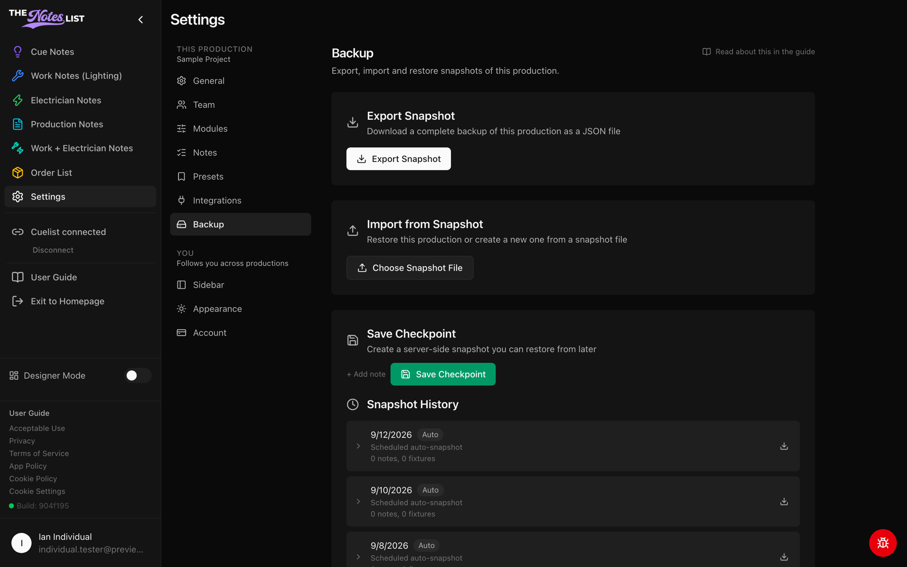

# Backup Settings

**Settings → Backup** can prove to be a crucial part of your workflow. It keeps copies of your production that you can download or restore.



### Export and import

* **Export Snapshot** downloads a complete backup of the production as a JSON file, at any time.
* **Import from Snapshot** uses one of those files to restore this production to that save point, or to create a new production from it.

<figure><figcaption></figcaption></figure>



### Checkpoints and history

Admins can **Save Checkpoint** to store a snapshot on the server, with an optional note, before a big change.

**Snapshot History** lists every saved snapshot: your checkpoints, the automatic snapshots The Notes List takes on a schedule, and the ones taken before an import or restore. Any of them can be downloaded as a complete JSON file, and admins can restore from them.


