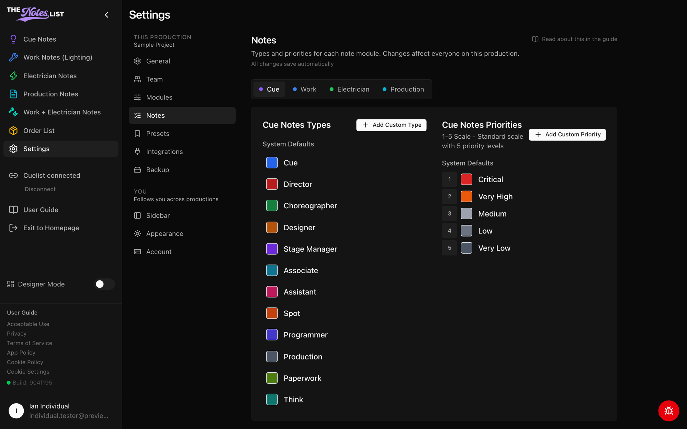

# Note Types & Priorities

Types and priorities for every note module live in one place: **Settings → Notes**. Changes here affect everyone working on the production.



### Pick a module

At the top of the Notes section, choose the module you want to edit: **Cue**, **Work**, **Electrician** or **Production**. Each has its own colored dot. Only modules that are switched on for the production appear here. An admin can turn modules on under [Modules](production-settings.md).

<figure><figcaption></figcaption></figure>



### Types

Types are the categories that appear in the Quick Adds for that module, such as Director, Designer or Spot for Cue Notes.

* **System defaults** can be edited (new name or color), hidden if your show doesn't use them, and reset to their original name and color at any time.
* **Add Custom Type** creates a type of your own. Custom types can be edited or deleted.



### Priorities

Priorities rank how urgent a note is. Cue Notes and Production Notes use a 5-level scale (Critical, Very High, Medium, Low, Very Low).

* Rename or recolor any priority to match how your team talks.
* **Add Custom Priority** creates a new level. Custom priorities can be reordered or deleted.



Module-specific notes: [Work & Electrician Notes](work-notes-settings.md) · [Production Notes](production-notes-settings.md)
