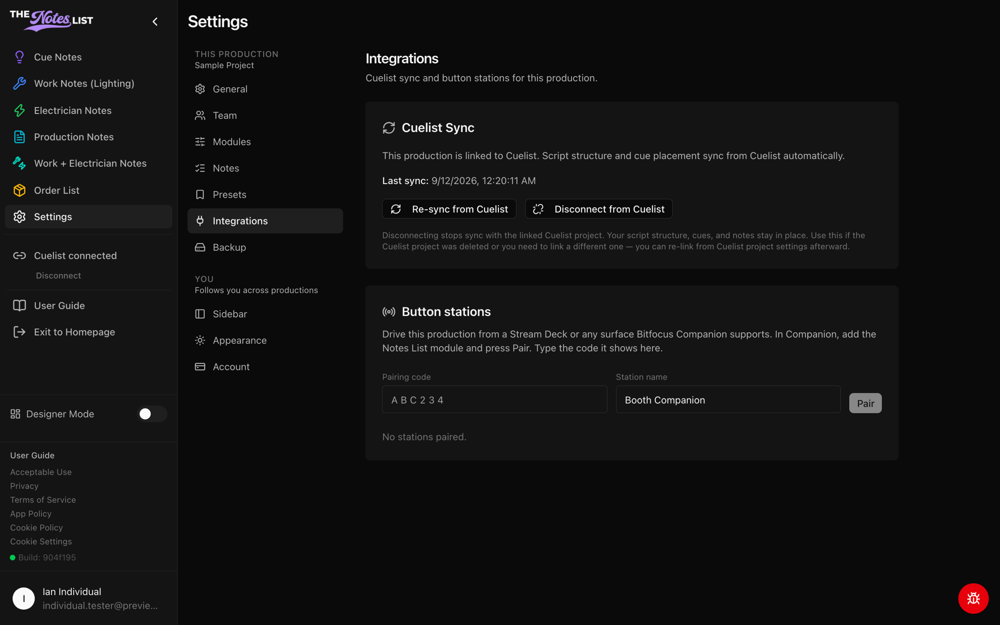

# Integrations Settings

**Settings → Integrations** connects the production to Cuelist and to hardware button stations.



### Cuelist Sync

When the production is linked to a Cuelist project, script structure and cue placement sync from Cuelist automatically. This card shows when the last sync happened and offers:

* **Re-sync from Cuelist** pulls the latest structure right away.
* **Disconnect from Cuelist** stops syncing. Your script structure, cues and notes stay in place. Use this if the Cuelist project was deleted or you need to link a different one.

If the production isn't linked, the card says so. Linking starts in Cuelist, from the project's settings, by the project owner. **Open Cuelist** takes you there.

<figure><figcaption></figcaption></figure>



### Button stations

Drive the production from a Stream Deck or any surface Bitfocus Companion supports:

1. In Companion, add The Notes List module and press **Pair**.
2. Type the code Companion shows into **Pairing code**, give the station a name, and press **Pair**.

Paired stations are listed below with when they were last seen. **Revoke** disconnects one.

Pairing a station needs an active licence, Show Pass or Dual for the production. Viewers can't pair stations; ask a production admin to set one up.


