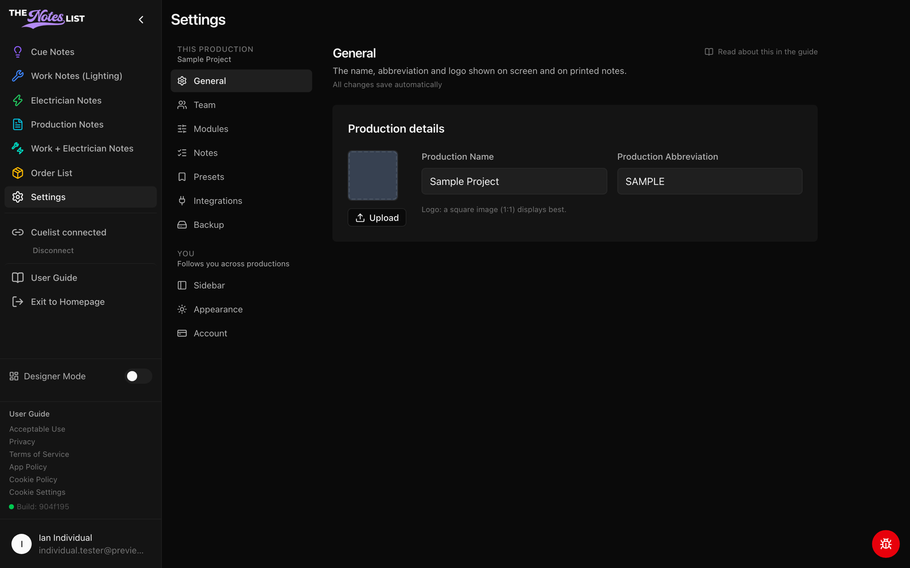
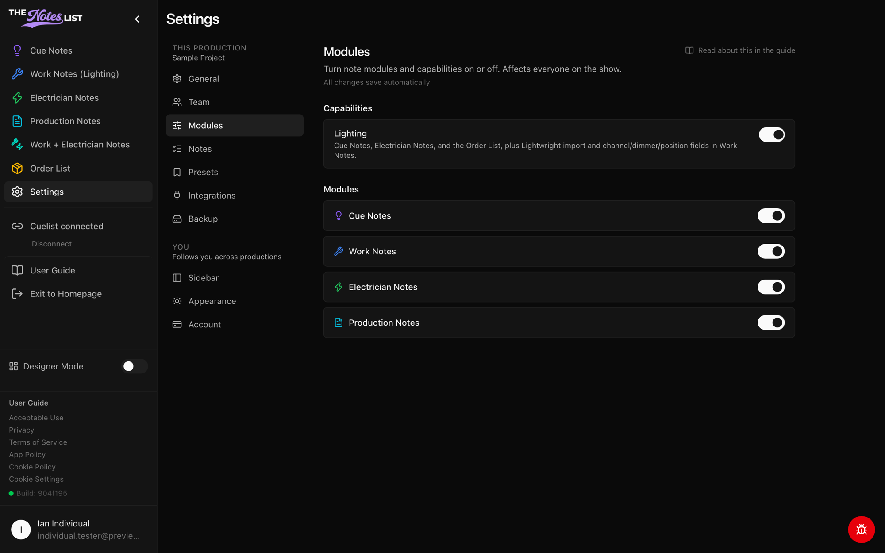

# Production Settings

Settings is where you shape a production to fit your team. Open it from **Settings** in the left sidebar.



### Finding your way around

Settings is split into two groups, listed down the left side of the page:

* **This production**: General, Team, Modules, Notes, Presets, Integrations and Backup. Changes here affect everyone working on the show. The production's name appears under the group heading so you always know which show you're editing.
* **You**: Sidebar, Appearance and Account. These are your personal preferences, and they follow you to every production you work on.

Click a section to open it. Each section has its own web address, so you can bookmark it or send the link to a teammate, and your browser's Back button takes you to the section you were on before. On a phone, the list becomes a **Section** dropdown at the top of the page.

Most settings save automatically as you change them. There's no Save button to remember.

<figure><figcaption></figcaption></figure>



### General

**General** holds the production's details, shown on screen and on printed notes:

* Production name and abbreviation
* Production logo. Use **Upload** to add one and **Remove** to go back to the default. A square image (1:1) displays best.

Only production admins can change these. Everyone else sees them as view-only.



### Modules

**Modules** turns note modules on or off for the whole production. Only production admins see this section.

* **Capabilities**: turning off **Lighting** hides Cue Notes, Electrician Notes and the Order List, along with Lightwright import and the channel, dimmer and position fields in Work Notes.
* **Modules**: switch Cue Notes, Work Notes, Electrician Notes and Production Notes on or off individually. At least one module must stay on.

These switches affect everyone on the show. To hide a module just for yourself, use [Sidebar](your-settings.md) instead.

<figure><figcaption></figcaption></figure>



Looking for something else? Types and priorities are under [Notes](cue-note-settings.md), email and print setups are under [Presets](action-presets.md), people and join codes are under [Team](team-member-settings.md), Cuelist and button stations are under [Integrations](integrations-settings.md), and snapshots are under [Backup](backup-settings.md).
