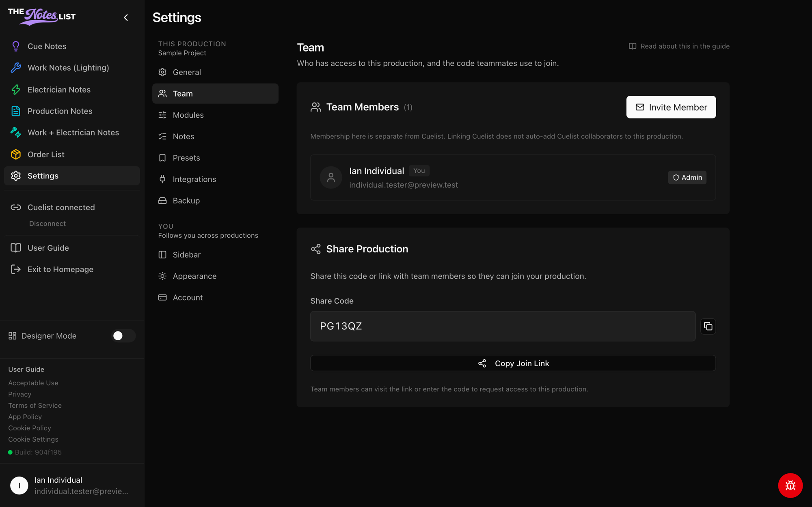

# Team Settings

**Settings → Team** shows who has access to the production and how new people join.



### Team Members

The member list shows everyone on the production and their role. The admin of the project gets a badge next to their name.

Admins can use **Invite Member** to send an email invitation and choose a role:

* **Viewer**: can view notes and check them off
* **Member**: can view and edit notes
* **Admin**: can also manage the team and production settings

Pending invitations are listed below the members until they're accepted. Admins can re-invite or cancel them there.

Membership here is separate from Cuelist. Linking a Cuelist project does not add its collaborators to your production.

<figure><figcaption></figcaption></figure>



### Share Production

Every production has a **share code** and a **join link**. Send either to a teammate: they can enter the code, or open the link, to request access to the production.


