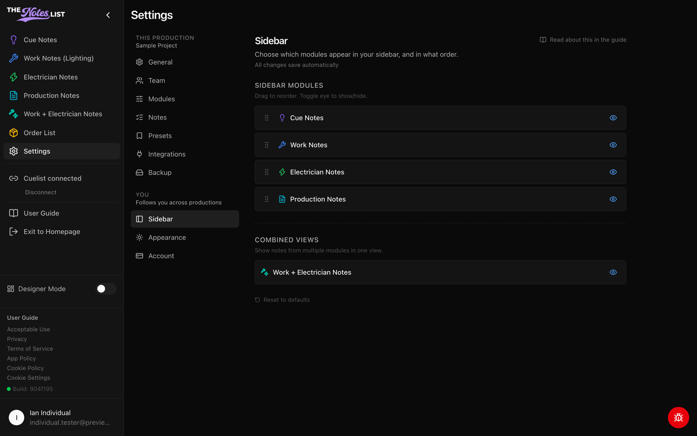
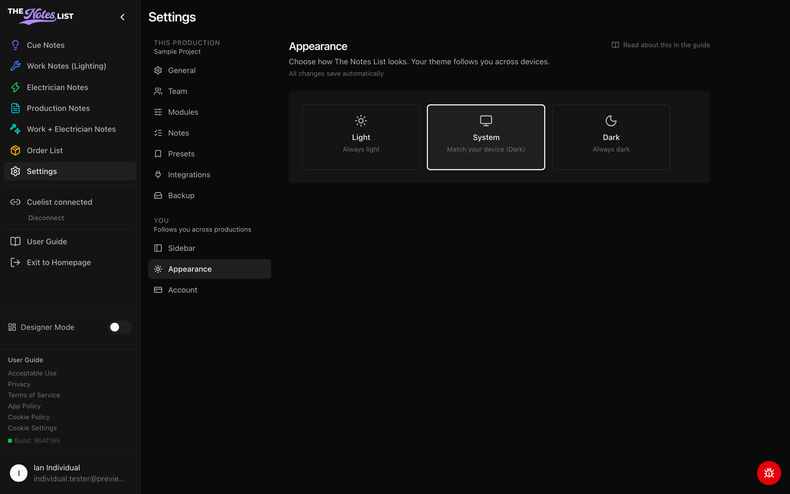
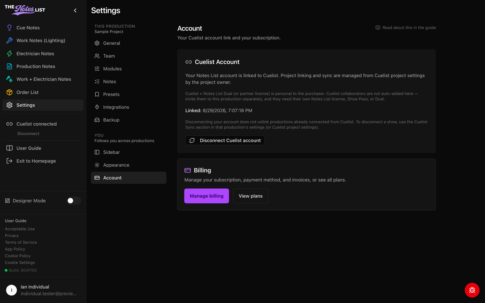

# Your Settings

The **You** group in Settings holds your personal preferences. They follow you to every production you work on and don't change anything for your teammates.



### Sidebar

Choose which modules appear in your left sidebar, and in what order.

* Drag a module by its handle to reorder it.
* Click the eye icon to show or hide it.
* Under **Combined Views**, turn on Work + Electrician Notes to see both in one list.
* **Reset to defaults** puts everything back.

Hiding a module here only hides it for you. To turn a module off for the whole production, an admin uses [Modules](production-settings.md).

<figure><figcaption></figcaption></figure>



### Appearance

Pick **Light**, **Dark** or **System** (match your device). Your choice follows you across devices. **Reset to system default** switches back to System.

<figure><figcaption></figcaption></figure>



### Account

* **Cuelist Account** shows whether your Notes List account is linked to Cuelist. Linking starts in Cuelist, from your account settings. You can disconnect your account here.
* **Billing**: **Manage billing** opens your subscription, payment method and invoices. **View plans** compares plans.
* **Show Passes** lists the productions you've bought a Show Pass for.

You can also reach billing any time from **Billing** in the account menu. See [Plans Available](../plans-billing/plans-available.md) for what each plan includes.

<figure><figcaption></figcaption></figure>


